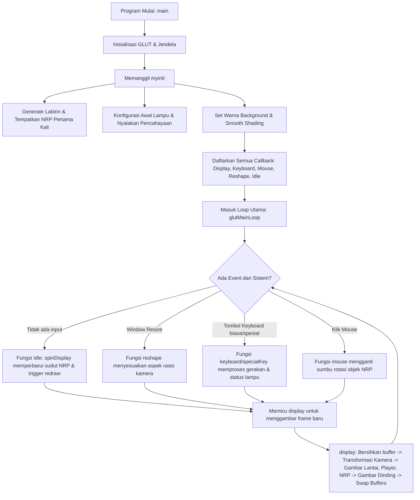

# Panduan Studi Kelompok & Dokumentasi Kode Sumber `main.cpp`
## Proyek UAS Grafika Komputer (Labirin 3D & Animasi NRP)

Dokumentasi ini dirancang secara khusus untuk **studi kelompok** dalam mempersiapkan **Asistensi Demo**. Panduan ini membedah arsitektur kode secara menyeluruh, mencakup pustaka yang digunakan, fungsi-fungsi OpenGL/GLUT, analisis algoritma, alur eksekusi program, serta panduan modifikasi parameter ("jika diubah akan menjadi apa").

---

## 1. Pustaka (Libraries) & API yang Digunakan

Aplikasi ini menggunakan beberapa pustaka C++ standar dan pustaka grafis OpenGL/GLUT:

### A. Pustaka Standar C++
*   **`<windows.h>`**: Diperlukan di sistem operasi Windows sebelum menyertakan pustaka OpenGL (`GL/glut.h`). Pustaka ini menyediakan interaksi tingkat rendah dengan OS Windows (seperti alokasi memori dan windowing context).
*   **`<cmath>`**: Menyediakan fungsi-fungsi matematika seperti `cos()`, `sin()`, dan perhitungan konstanta $\pi$ (Pi). Pustaka ini digunakan untuk menghitung arah pandang kamera FPS berdasarkan sudut horizontal (yaw) dalam radian: $\text{lookX} = \text{camPosX} + \cos(\text{radYaw})$.
*   **`<cstdio>`**: Digunakan untuk operasi input/output standar di konsol, seperti fungsi `printf()` untuk mencetak pesan `"Dapat NRP!"` saat terjadi tabrakan antara pemain dan objek tujuan.

### B. OpenGL & GLUT Utility Toolkit (`<GL/glut.h>`)
*   **OpenGL Utility Toolkit (GLUT)**: Pustaka pembantu (*windowing library*) yang mengabstraksi pembuatan window, penanganan input keyboard/mouse, serta pengaturan timer dan event loop utama (`glutMainLoop`). Ini membuat kode portabel antar sistem operasi (Windows/macOS/Linux).

---

## 2. Kamus Istilah API OpenGL & GLUT (Fungsi Bawaan)

Asisten dosen sering menanyakan arti dari fungsi-fungsi OpenGL/GLUT yang diawali dengan awalan `gl`, `glu`, atau `glut`. Berikut adalah fungsi-fungsi yang digunakan dalam kode ini beserta kegunaannya:

### A. GLUT Callbacks & Windowing (`glut*`)
*   **`glutInit`**: Menginisialisasi pustaka GLUT dan memproses argumen baris perintah.
*   **`glutInitDisplayMode`**: Mengatur mode tampilan untuk window. Kode kita menggunakan:
    *   `GLUT_DOUBLE`: Menggunakan dua buffer (*double buffering*) untuk mencegah efek berkedip (*flickering*) pada animasi. Gambar baru di-render di buffer belakang, lalu ditukar dengan buffer depan menggunakan `glutSwapBuffers()`.
    *   `GLUT_RGB`: Menggunakan format pewarnaan Red, Green, Blue.
    *   `GLUT_DEPTH`: Mengaktifkan *Z-buffer* untuk pengujian kedalaman objek 3D.
    *   `GLUT_ALPHA`: Menyediakan saluran alpha untuk transparansi warna (blending).
*   **`glutInitWindowSize`**: Mengatur ukuran awal jendela aplikasi (700 x 700 piksel).
*   **`glutCreateWindow`**: Membuat jendela visual dengan judul tertentu.
*   **`glutMainLoop`**: Memulai loop utama GLUT yang menangani penggambaran ulang, interaksi keyboard, dan mouse secara terus-menerus.
*   **`glutPostRedisplay`**: Memberitahu GLUT bahwa scene perlu digambar ulang pada frame berikutnya (memicu pemanggilan fungsi `display`).
*   **`glutDisplayFunc`**: Mendaftarkan fungsi callback untuk menggambar scene grafis (mendaftarkan fungsi `display`).
*   **`glutKeyboardFunc`**: Mendaftarkan callback untuk tombol keyboard standar (seperti `W, A, S, D, V, C, 1-5`).
*   **`glutSpecialFunc`**: Mendaftarkan callback untuk tombol keyboard khusus (seperti tombol panah atas/bawah/kiri/kanan).
*   **`glutMouseFunc`**: Mendaftarkan callback untuk menangani klik mouse (kiri, kanan, tengah).
*   **`glutReshapeFunc`**: Mendaftarkan callback saat ukuran jendela diubah oleh pengguna.
*   **`glutIdleFunc`**: Mendaftarkan callback yang dijalankan terus-menerus saat program dalam kondisi santai/tidak menerima input (digunakan untuk memperbarui animasi rotasi NRP).

### B. OpenGL Utility (`glu*`)
*   **`gluPerspective(fov, aspect, zNear, zFar)`**: Mengatur proyeksi perspektif 3D.
    *   `fov` (Field of View): Sudut vertikal bidang pandang kamera (65.0 derajat).
    *   `aspect`: Rasio lebar banding tinggi jendela agar objek tidak memanjang/memipih saat window di-resize.
    *   `zNear` dan `zFar`: Jarak bidang potong terdekat (0.1 unit) dan terjauh (100.0 unit) dari kamera.
*   **`gluLookAt(eyex, eyey, eyez, centerx, centery, centerz, upx, upy, upz)`**: Menentukan posisi dan arah hadap kamera FPS.
    *   `eye`: Posisi mata kamera berada.
    *   `center`: Titik koordinat yang sedang dipandang oleh kamera.
    *   `up`: Vektor arah atas kamera (searah sumbu Z, yaitu `0.0, 0.0, 1.0`).

### C. OpenGL Core (`gl*`)
*   **`glClear`**: Membersihkan layar dan buffer kedalaman (`GL_COLOR_BUFFER_BIT | GL_DEPTH_BUFFER_BIT`) agar frame sebelumnya tidak menumpuk.
*   **`glLoadIdentity`**: Mereset matriks transformasi aktif saat ini menjadi matriks identitas (kembali ke posisi awal/default).
*   **`glMatrixMode`**: Memilih matriks mana yang akan dimodifikasi:
    *   `GL_PROJECTION`: Digunakan untuk mengatur kamera/proyeksi (seperti lensa kamera).
    *   `GL_MODELVIEW`: Digunakan untuk mengatur perpindahan, rotasi, dan skala objek (seperti tata letak benda di panggung).
*   **`glOrtho`**: Mengatur proyeksi ortogonal (proyeksi sejajar 2D/3D tanpa perspektif).
*   **`glViewport`**: Mengatur area layar di dalam jendela yang akan digunakan untuk menggambar.
*   **`glBegin` / `glEnd`**: Menandai awal dan akhir penggambaran primitif grafis (seperti `GL_POLYGON` untuk membuat bidang datar).
*   **`glVertex3f`**: Menentukan koordinat verteks 3D `(x, y, z)`.
*   **`glNormal3f`**: Menentukan arah normal permukaan 3D `(x, y, z)`. Arah normal harus keluar dari permukaan agar efek pencahayaan (lighting) dapat dihitung dengan benar oleh OpenGL.
*   **`glPushMatrix` / `glPopMatrix`**: Menyimpan dan mengambil kembali konfigurasi matriks transformasi. Sangat penting untuk mengisolasi transformasi lokal suatu objek (misal: memutar NRP saja tanpa memutar labirin).
*   **`glRotated` / `glTranslated`**: Melakukan operasi perkalian matriks rotasi (putar) dan translasi (geser) pada objek grafis.
*   **`glEnable` / `glDisable`**: Mengaktifkan atau menonaktifkan fitur bawaan OpenGL (seperti pencahayaan `GL_LIGHTING`, pengujian kedalaman `GL_DEPTH_TEST`, atau pencampuran warna `GL_BLEND`).
*   **`glMaterialfv`**: Mengatur parameter material permukaan objek (seperti kilap, warna redup, warna diffuse).
*   **`glLightfv`**: Mengatur parameter sumber cahaya (posisi, warna diffuse, warna specular).
*   **`glLightModelfv`**: Menentukan model pencahayaan global (seperti ambient global).
*   **`glShadeModel`**: Menentukan teknik bayangan warna (shading). Kita menggunakan `GL_SMOOTH` (Gouraud shading) yang menghitung interpolasi warna antar verteks agar tampak mulus, berbeda dari `GL_FLAT` yang memberi warna datar seragam per poligon.
*   **`glBlendFunc`**: Mengatur fungsi pencampuran warna untuk efek transparansi.
*   **`glDepthMask`**: Mengaktifkan/menonaktifkan penulisan ke Z-buffer. Dinonaktifkan saat merender objek transparan agar objek di belakangnya tetap digambar.

---

## 3. Alur Eksekusi Program (Flow of Execution)

Berikut adalah urutan jalannya program dari awal dijalankan hingga interaksi pengguna terjadi:



---

## 4. Analisis Struktur Fungsi & Sample Code

Berikut adalah daftar fungsi utama di dalam kode `main.cpp` beserta cuplikan kodenya untuk dipelajari:

### A. Pembentukan Labirin (`generateMaze`)
Algoritma ini menggunakan pembentukan labirin acak berbasis grid biner terhubung.

```cpp
void generateMaze() {
    // 1. Set seluruh grid berukuran 17x17 sebagai dinding solid (true)
    for (int y = 0; y < 17; y++) {
        for (int x = 0; x < 17; x++) {
            mazeGrid[y][x] = true;
        }
    }
    // 2. Iterasi sel jalan ganjil (y dan x melompati 2 sel)
    for (int y = 1; y < 16; y += 2) {
        for (int x = 1; x < 16; x += 2) {
            mazeGrid[y][x] = false; // Buka sel jalan aktif
            bool canMoveRight = (x + 2 < 16);
            bool canMoveDown = (y + 2 < 16);
            
            // 3. Rubuhkan partisi pembatas ke kanan atau ke bawah secara acak (rand % 2)
            if (canMoveRight && canMoveDown) {
                if (rand() % 2 == 0) {
                    mazeGrid[y][x + 1] = false; // Buka dinding kanan
                } else  {
                    mazeGrid[y + 1][x] = false; // Buka dinding bawah
                }
            } else if (canMoveRight) {
                mazeGrid[y][x + 1] = false;
            } else if (canMoveDown) {
                mazeGrid[y + 1][x] = false;
            }
        }
    }
    // 4. Buka gerbang masuk dan keluar
    mazeGrid[0][7] = false; 
    mazeGrid[16][7] = false;
}
```

*   **Cara Kerja**: Dinding pembatas antar sel dikosongkan secara acak. Karena setiap sel jalan ganjil dijamin terhubung ke tetangganya (baik kanan atau bawah), algoritma ini menghasilkan labirin terhubung sempurna (*perfect maze*) tanpa ada bagian jalan yang terisolasi.

### B. Penempatan NRP Acak (`letakkanNRP`)
Mencegah objek hijau "103" muncul di atas dinding labirin.

```cpp
void letakkanNRP() {
    int rx, ry;
    do {
        rx = 1 + rand() % 15; // acak index X dari 1 s.d 15
        ry = 1 + rand() % 15; // acak index Y dari 1 s.d 15
    } while (mazeGrid[ry][rx] == true); // ulangi jika koordinat tersebut adalah dinding

    nrpPosX = (float)rx + 0.5; // atur posisi di tengah sel grid
    nrpPosY = (float)ry + 0.4;
}
```

*   **Cara Kerja**: Loop `do-while` akan terus mengacak koordinat baris (`ry`) dan kolom (`rx`) sampai menemukan sel di mana `mazeGrid[ry][rx] == false` (jalan kosong).

### C. Menggambar Objek Dinding Transparan & Blending (`display`)
Bagian ini mengatur bagaimana dinding digambar tembus pandang jika diaktifkan.

```cpp
    // Di dalam fungsi display()...
    
    // 1. Gambar objek solid terlebih dahulu dengan Depth Mask aktif dan Blending mati
    glDepthMask(GL_TRUE);
    glDisable(GL_BLEND);
    drawPlayer((float)playerX, (float)playerY);
    drawNRP3D();
    drawLantai();

    // 2. Gambar objek transparan (Dinding) dengan blending diaktifkan
    if (wallTransparent) {
        glEnable(GL_BLEND);
        glBlendFunc(GL_SRC_ALPHA, GL_ONE_MINUS_SRC_ALPHA);
        glDepthMask(GL_FALSE); // Matikan penulisan ke Depth Buffer
    }
    
    // Gambar seluruh dinding di grid
    for (int y = 0; y < 17; y++) {
        for (int x = 0; x < 17; x++) {
            if (mazeGrid[y][x] == true) {
                drawDinding((float)x, (float)y);
            }
        }
    }
    
    // Kembalikan status state ke normal
    if (wallTransparent) {
        glDepthMask(GL_TRUE);
        glDisable(GL_BLEND);
    }
```

*   **Penting**: Objek transparan harus digambar **setelah** objek pekat (solid). Penonaktifkan penulisan ke Depth Buffer dengan `glDepthMask(GL_FALSE)` mencegah OpenGL memblokir rendering pixel di belakang dinding transparan tersebut.

---

## 5. Studi Kasus: "Jika Diubah Jadi Apa?" (Panduan Modifikasi)

Asisten praktikum sering menanyakan pemahaman kode dengan skenario perubahan. Berikut adalah jawaban cepat yang dapat Anda berikan:

### A. "Bagaimana jika ukuran labirin diubah menjadi 25x25?"
*   **Yang harus diubah**:
    1.  Ubah deklarasi grid: `bool mazeGrid[25][25]`.
    2.  Ubah batas loop di `generateMaze` (misalnya batas `y < 24` dan `x < 24`), `display`, dan penanganan batas keyboard.
    3.  Ubah titik spawn pintu masuk/keluar.
    4.  Ubah parameter `glOrtho` di fungsi `reshape` dan `myinit` (misalnya batas kanan/bawah diubah dari `21.0` ke `29.0`) agar seluruh labirin berukuran lebih besar muat di dalam layar.

### B. "Bagaimana jika ingin mempercepat gerakan kamera FPS?"
*   **Yang harus diubah**: Ubah nilai variabel `moveSpeed` di dalam fungsi `specialKey` (baris 1010) dari `0.3f` menjadi lebih besar (misal: `0.8f`).
    ```cpp
    float moveSpeed = 0.8f; // Kamera bergerak lebih cepat
    ```

### C. "Bagaimana jika ingin memperhalus gerakan rotasi objek NRP?"
*   **Yang harus diubah**: Ubah increment sudut rotasi di dalam fungsi `spinDisplay` (baris 786) dari `0.8` menjadi lebih kecil (misal: `0.2`) namun program dijalankan lebih sering, atau diubah menjadi lebih besar jika ingin putaran lebih cepat.
    ```cpp
    nrpSpinAngle = nrpSpinAngle + 2.0; // Putaran menjadi lebih cepat
    ```

### D. "Bagaimana jika warna dinding ingin diubah menjadi kuning?"
*   **Yang harus diubah**: Ubah komponen warna `diffuse` dan `ambient` material di dalam fungsi `drawDinding` (baris 48-49) menjadi format RGB kuning (merah + hijau):
    ```cpp
    GLfloat mat_ambient[]  = { 0.3f, 0.3f, 0.0f, alpha }; // Ambient kuning redup
    GLfloat mat_diffuse[]  = { 0.8f, 0.8f, 0.0f, alpha }; // Diffuse kuning terang
    ```

### E. "Bagaimana jika ingin mengubah arah cahaya lampu diffuse?"
*   **Yang harus diubah**: Ubah koordinat posisi lampu `light0_pos` di dalam fungsi `myinit` (baris 1074).
    ```cpp
    GLfloat light0_pos[] = { -5.0f, 8.5f, 10.0f, 1.0f }; // Lampu digeser lebih ke kiri (nilai X negatif)
    ```
    *   Jika parameter keempat bernilai `1.0f`, lampu bersifat posisional (seperti lampu bohlam). Jika diubah menjadi `0.0f`, lampu akan menjadi directional (seperti sinar matahari dari arah vektor tersebut).

### F. "Bagaimana jika ingin membuat dinding benar-benar tidak terlihat saat transparan?"
*   **Yang harus diubah**: Ubah nilai alpha pada variabel `alpha` di dalam fungsi `drawDinding` (baris 46) dari `0.3f` menjadi `0.0f`.
    ```cpp
    float alpha = wallTransparent ? 0.0f : 1.0f; // Dinding transparan menjadi sepenuhnya tak terlihat
    ```

### G. "Apa yang terjadi jika `glShadeModel(GL_SMOOTH)` diganti menjadi `GL_FLAT`?"
*   **Jawaban**: Permukaan objek 3D tidak akan memiliki gradasi pencahayaan yang halus lagi. Setiap poligon pembentuk kubus/NRP akan memiliki satu warna solid datar yang seragam berdasar kalkulasi normal verteks terakhirnya, sehingga efek visualnya akan tampak lebih kotak-kotak (*low-poly look*).

### H. "Apa kegunaan dari `glEnable(GL_DEPTH_TEST)` di `myinit`?"
*   **Jawaban**: Untuk menyalakan pengujian kedalaman (*Z-buffer*). Jika dinonaktifkan, OpenGL tidak akan memedulikan jarak objek dari kamera, sehingga objek yang digambar terakhir kali akan selalu muncul di depan layar meskipun secara spasial posisinya ada di belakang objek lain.

---

## 6. Cheat Sheet Kontrol Cepat Asistensi

| Kategori | Tombol | Aksi / Efek Visual |
| :--- | :--- | :--- |
| **Pemain** | `W, A, S, D` | Gerak Maju, Kiri, Mundur, Kanan (kubus biru) |
| **Labirin** | `C` | Mengacak ulang labirin secara prosedural & reset posisi NRP |
| **Kamera** | `V` | Berganti mode visualisasi (2D $\rightarrow$ 3D Isometrik $\rightarrow$ 3D FPS) |
| **Mode Isometrik** | `I, K` / `J, L` | Memutar labirin ke atas-bawah / kiri-kanan |
| **Mouse (Mode 1)** | Klik Kiri / Kanan / Tengah | Mengubah sumbu putar objek hijau NRP (Sumbu X / Y / Z) |
| **Mode FPS** | Panah Atas / Bawah | Melangkah maju / mundur searah pandangan kamera |
| **Mode FPS** | Panah Kiri / Kanan | Menengokkan kamera ke kiri / kanan |
| **Pencahayaan** | `1` / `2` / `3` | Toggle lampu Ambient / Diffuse / Specular |
| **Siklus Siang** | `4` | Toggle Siang / Malam (mengubah rona cahaya & background) |
| **Dinding** | `5` | Toggle Transparansi Dinding (aktifkan efek tembus pandang) |
